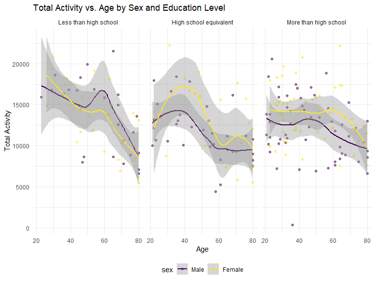

HW3_yx2857
================
Yifan Xu
2024-10-13

**Problem 1**

``` r
library(p8105.datasets)
data("ny_noaa")

ny_noaa %>% summary()
```

    ##       id                 date                 prcp               snow       
    ##  Length:2595176     Min.   :1981-01-01   Min.   :    0.00   Min.   :  -13   
    ##  Class :character   1st Qu.:1988-11-29   1st Qu.:    0.00   1st Qu.:    0   
    ##  Mode  :character   Median :1997-01-21   Median :    0.00   Median :    0   
    ##                     Mean   :1997-01-01   Mean   :   29.82   Mean   :    5   
    ##                     3rd Qu.:2005-09-01   3rd Qu.:   23.00   3rd Qu.:    0   
    ##                     Max.   :2010-12-31   Max.   :22860.00   Max.   :10160   
    ##                                          NA's   :145838     NA's   :381221  
    ##       snwd            tmax               tmin          
    ##  Min.   :   0.0   Length:2595176     Length:2595176    
    ##  1st Qu.:   0.0   Class :character   Class :character  
    ##  Median :   0.0   Mode  :character   Mode  :character  
    ##  Mean   :  37.3                                        
    ##  3rd Qu.:   0.0                                        
    ##  Max.   :9195.0                                        
    ##  NA's   :591786

``` r
ny_noaa <- ny_noaa %>% 
  separate(date, into = c("year", "month", "day"), convert = TRUE) %>% 
  mutate(
    tmax = as.numeric(tmax),
    tmin = as.numeric(tmin))

ny_noaa %>% 
  count(snow) %>%
  arrange(desc(n))
```

    ## # A tibble: 282 × 2
    ##     snow       n
    ##    <int>   <int>
    ##  1     0 2008508
    ##  2    NA  381221
    ##  3    25   31022
    ##  4    13   23095
    ##  5    51   18274
    ##  6    76   10173
    ##  7     8    9962
    ##  8     5    9748
    ##  9    38    9197
    ## 10     3    8790
    ## # ℹ 272 more rows

The `NY_NOAA` dataset contains 2595176 observations and 9 variables. The
variables are: id, year, month, day, prcp, snow, snwd, tmax, tmin. The
dataset contains information about the weather in New York, and the
variables include weather station id, date of observation, precipitation
(tenths of mm), snowfall (mm), snow depth (mm), and min and max
temperature (tenths of degrees C).  
Missing data is found cross observations for temperature, precipitation,
and snowfall. The missing rate of min and max temperature are the
highest, which are 44% and 44%, respectively. The missing rate of
precipitation is 6%, the missing rate of snowfall is 15%, and the
missing rate of snow depth is 23%.

0 is the most commonly observed value for snowfall. This is because most
days of the year, it does not snow at all in NY. The second most
commonly observed value is `NA`, indicating missingness. Other common
values are 25, 13, 51, and 76, suggesting that snowfall is originally
recorded in units of inch and converted to mm.

``` r
ny_noaa  %>% 
  group_by(id, year, month) %>% 
  filter(month %in% c(1, 7)) %>% 
  summarize(mean_tmax = mean(tmax, na.rm = TRUE, color = id)) %>% 
  ggplot(aes(x = year, y = mean_tmax, group = id)) + geom_point() + geom_path() +
  facet_grid(~month) +
  labs(title = "Mean monthly temperature for each station across years for January and July")
```

    ## `summarise()` has grouped output by 'id', 'year'. You can override using the
    ## `.groups` argument.


The mean temperature in January is much lower than the mean temperature
in July for all stations and across all years. We can observe that
temperature measurements at all stations are highly uniform in trend,
from peak to valley, across the years, and this pattern appears both in
January and July.  
We can see one uncharacteristically cold station in July of 1987 or
1988, as well as a few other less drastic outliers.

*Make a two-panel plot showing*  
(i) tmax vs tmin for the full dataset (note that a scatterplot may not
be the best option)  
(ii) make a plot showing the distribution of snowfall values greater
than 0 and less than 100 separately by year.

``` r
hex = 
  ny_noaa %>% 
  ggplot(aes(x = tmin, y = tmax)) + 
  geom_hex()+
  theme(legend.text = element_text(size = 5) )

ridge = 
  ny_noaa %>% 
  filter(snow < 100, snow > 0) %>%
  ggplot(aes(x = snow, y = as.factor(year))) + 
  geom_density_ridges()

hex + ridge
```

    ## Picking joint bandwidth of 3.76


``` r
rm(ny_noaa )
```

**Problem 2**

``` r
accel <- read_csv("data/nhanes_accel.csv")
```

    ## Rows: 250 Columns: 1441
    ## ── Column specification ────────────────────────────────────────────────────────
    ## Delimiter: ","
    ## dbl (1441): SEQN, min1, min2, min3, min4, min5, min6, min7, min8, min9, min1...
    ## 
    ## ℹ Use `spec()` to retrieve the full column specification for this data.
    ## ℹ Specify the column types or set `show_col_types = FALSE` to quiet this message.

``` r
covar <- read_csv("data/nhanes_covar.csv", skip = 4) %>% 
        filter(age >= 21)  %>% 
        na.omit %>%
        mutate(sex = factor(sex, levels = c(1, 2), labels = c("Male", "Female"))) %>%
        mutate(education = factor(education, levels = c(1, 2, 3), labels = c("Less than high school", "High school equivalent", "More than high school")))
```

    ## Rows: 250 Columns: 5
    ## ── Column specification ────────────────────────────────────────────────────────
    ## Delimiter: ","
    ## dbl (5): SEQN, sex, age, BMI, education
    ## 
    ## ℹ Use `spec()` to retrieve the full column specification for this data.
    ## ℹ Specify the column types or set `show_col_types = FALSE` to quiet this message.

``` r
accel_tidy <- left_join(covar, accel) %>% janitor::clean_names()
```

    ## Joining with `by = join_by(SEQN)`

``` r
# Produce a reader-friendly table for the number of men and women in each education category
accel_tidy %>% 
  count(sex, education) 
```

    ## # A tibble: 6 × 3
    ##   sex    education                  n
    ##   <fct>  <fct>                  <int>
    ## 1 Male   Less than high school     27
    ## 2 Male   High school equivalent    35
    ## 3 Male   More than high school     56
    ## 4 Female Less than high school     28
    ## 5 Female High school equivalent    23
    ## 6 Female More than high school     59

``` r
# create a visualization of the age distributions by sex in each education category
accel_tidy %>% ggplot(aes(x = sex, y = age, fill = sex)) +
  geom_boxplot() +
  facet_wrap(~ education) +
  labs(title = "Age Distribution by Sex in Each Education Category",
       x = "Sex",
       y = "Age") 
```


From the table and the plot, we can see that male and female
participants are evenly distributed across education levels. The age
distribution of participants is similar in education category “less than
high school” and “More than high school”, and median age of female with
“High school equivalent” is higher than the male. The median age of
participants in the “More than high school” category being slightly
lower than the other two categories.

``` r
# Traditional analyses of accelerometer data focus on the total activity over the day. Using your tidied dataset, aggregate across minutes to create a total activity variable for each participant. Plot these total activities (y-axis) against age (x-axis); your plot should compare men to women and have separate panels for each education level. Include a trend line or a smooth to illustrate differences. Comment on your plot.

accel_tidy %>% 
   mutate(total_activity = rowSums(select(., starts_with("min")))) %>% 
   ggplot(aes(x = age, y = total_activity, color = sex)) +
   geom_point(alpha = 0.5) + 
   geom_smooth() +
  facet_wrap(~ education) +  # Facet the plot by education level
  labs(
    title = "Total Activity vs. Age by Sex and Education Level",
    x = "Age",
    y = "Total Activity"
  )  
```

    ## `geom_smooth()` using method = 'loess' and formula = 'y ~ x'


According to the plot, we can see that the total activity of
participants decreases with age. The total activity of female
participants seems to have a steeper decline than male participants in
the “Less than high school” category of education. The total activity of
female participants with “High school equivalent” and “More than high
school” education level is higher than male participants. The overall
total activity of participants with “Less than high school” education
level at younger age is higher than the other two education levels at
younger age.

``` r
# Accelerometer data allows the inspection activity over the course of the day. Make a three-panel plot that shows the 24-hour activity time courses for each education level and use color to indicate sex. Describe in words any patterns or conclusions you can make based on this graph; including smooth trends may help identify differences. 


accel_tidy %>%
  pivot_longer(cols = starts_with("min"), names_to = "minute", values_to = "activity") %>%
  # Convert the minute column to numeric, then convert minutes to hours
  mutate(hour = as.numeric(str_remove(minute, "min")) / 60) %>%
  ggplot(aes(x = hour, y = activity, color = sex)) +
  geom_line(alpha = 0.5) +  
  geom_smooth(method = "loess", se = FALSE) +  
  facet_wrap(~ education) + 
  labs(
    title = "24-hour Activity Time Courses by Education Level",
    x = "Hour of the Day",
    y = "Activity Level",
    color = "Sex"
  ) +
  scale_x_continuous(breaks = seq(0, 24, by = 2)) + 
  theme_minimal()
```

    ## `geom_smooth()` using formula = 'y ~ x'


From this plot, we can learn the male participants with “More than high
school” are having more activity at night time than female of this
education. And participants with “more than high school”, both male and
female are having more activity at early morning time than the other two
categories.

``` r
rm(accel, accel_tidy, covar)
```

**Problem 3**

``` r
# Citi Bike is a bike sharing system in New York City; riders can rent pedal-powered or electric bikes from starting stations and return them to another station at their destination. Introduced in 2013, the system is immensely popular and expanded rapidly. Riders who use this system often may become “members” with lower rental rates.
# 
# This zip file contains data on rides taken on the NYC Citi Bike system. Files contain 1% of all rides with a total duration less than 4 hours in each of four months. Import, clean, and tidy these data, and describe the resulting dataset.

citi_bike <- read_csv("data/citibike/Jan 2020 Citi.csv") %>% 
  mutate( year = "2020", month = "January") %>%
  bind_rows(read_csv("data/citibike/July 2020 Citi.csv")%>% 
  mutate( year = "2020", month = "July") ) %>% 
  bind_rows(read_csv("data/citibike/Jan 2024 Citi.csv")%>% 
  mutate( year = "2024", month = "January") ) %>% 
  bind_rows(read_csv("data/citibike/July 2024 Citi.csv")%>% 
  mutate( year = "2024", month = "July") ) %>% 
  janitor::clean_names()
```

    ## Rows: 12420 Columns: 7
    ## ── Column specification ────────────────────────────────────────────────────────
    ## Delimiter: ","
    ## chr (6): ride_id, rideable_type, weekdays, start_station_name, end_station_n...
    ## dbl (1): duration
    ## 
    ## ℹ Use `spec()` to retrieve the full column specification for this data.
    ## ℹ Specify the column types or set `show_col_types = FALSE` to quiet this message.
    ## Rows: 21048 Columns: 7
    ## ── Column specification ────────────────────────────────────────────────────────
    ## Delimiter: ","
    ## chr (6): ride_id, rideable_type, weekdays, start_station_name, end_station_n...
    ## dbl (1): duration
    ## 
    ## ℹ Use `spec()` to retrieve the full column specification for this data.
    ## ℹ Specify the column types or set `show_col_types = FALSE` to quiet this message.
    ## Rows: 18861 Columns: 7
    ## ── Column specification ────────────────────────────────────────────────────────
    ## Delimiter: ","
    ## chr (6): ride_id, rideable_type, weekdays, start_station_name, end_station_n...
    ## dbl (1): duration
    ## 
    ## ℹ Use `spec()` to retrieve the full column specification for this data.
    ## ℹ Specify the column types or set `show_col_types = FALSE` to quiet this message.
    ## Rows: 47156 Columns: 7
    ## ── Column specification ────────────────────────────────────────────────────────
    ## Delimiter: ","
    ## chr (6): ride_id, rideable_type, weekdays, start_station_name, end_station_n...
    ## dbl (1): duration
    ## 
    ## ℹ Use `spec()` to retrieve the full column specification for this data.
    ## ℹ Specify the column types or set `show_col_types = FALSE` to quiet this message.

``` r
# Produce a reader-friendly table showing the total number of rides in each combination of year and month separating casual riders and Citi Bike members. Comment on these results.

citi_bike %>% 
  count(year, month, member_casual) 
```

    ## # A tibble: 8 × 4
    ##   year  month   member_casual     n
    ##   <chr> <chr>   <chr>         <int>
    ## 1 2020  January casual          984
    ## 2 2020  January member        11436
    ## 3 2020  July    casual         5637
    ## 4 2020  July    member        15411
    ## 5 2024  January casual         2108
    ## 6 2024  January member        16753
    ## 7 2024  July    casual        10894
    ## 8 2024  July    member        36262

According to the table, the number of rides in 2024 is higher than 2020.
The number of rides in January is lower than July in the same year. The
number of rides for members is higher than casual riders, but there are
more casual riders in 2024 in terms of proportion.

``` r
# Make a table showing the 5 most popular starting stations for July 2024; include the number of rides originating from these stations.

citi_bike %>% 
  filter(month == "July", year == "2024") %>% 
  count(start_station_name) %>% 
  arrange(desc(n)) %>% 
  head(5)
```

    ## # A tibble: 5 × 2
    ##   start_station_name           n
    ##   <chr>                    <int>
    ## 1 Pier 61 at Chelsea Piers   163
    ## 2 University Pl & E 14 St    155
    ## 3 W 21 St & 6 Ave            152
    ## 4 West St & Chambers St      150
    ## 5 W 31 St & 7 Ave            146

``` r
# Make a plot to investigate the effects of day of the week, month, and year on median ride duration. This plot can include one or more panels, but should facilitate comparison across all variables of interest. Comment on your observations from this plot.
 
citi_bike %>%
  group_by(year, month, weekdays) %>%
  summarize(median_duration = median(duration, na.rm = TRUE), .groups = "drop") %>% 
  ggplot(aes(x = factor(weekdays, levels = c("Monday", "Tuesday", "Wednesday", "Thursday", "Friday", "Saturday", "Sunday")), 
             y = median_duration, 
             color = interaction(year, month),  
             linetype = interaction(year, month),   
             group = interaction(year, month))) +   
  geom_line(size = 1) +  
  labs(title = "Median Ride Duration by Weekdays, Year, and Month",
       x = "Weekdays",
       y = "Median Ride Duration",
       color = "Year-Month",    
       linetype = "Year-Month") +
  theme(legend.position = "right")
```


According to the plot, we can see that the median ride duration is
higher in July than Jan. in the same year. The median ride duration is
higher in July than January. The median ride duration is generally
higher on weekends than weekdays, except for Jan. 2024.

``` r
# There were relatively few electric Citi Bikes in 2020, but many more are available now. For data in 2024, make a figure that shows the impact of month, membership status, and bike type on the distribution of ride duration. Comment on your results

citi_bike %>% 
  filter(year == "2024") %>% 
  ggplot(aes(x = duration, fill = member_casual)) + 
  geom_density(alpha = 0.5) + 
  facet_grid(~ month + rideable_type) + 
  labs(title = "Distribution of Ride Duration by Month, Membership Status, and Bike Type",
       x = "Duration (minutes)",
       y = "Density",
       fill = "Membership Status") +
  theme_minimal()
```


From the plot, we can read that the distribution of ride duration for
casual riders is flatter than members, and the distribution of ride
duration for electric bikes is less spread than classic bikes. The
shorter ride duration for electronic bike riders is higher in January
than July. The distribution of classic ride duration is pretty
consistent in Jan. and July.
